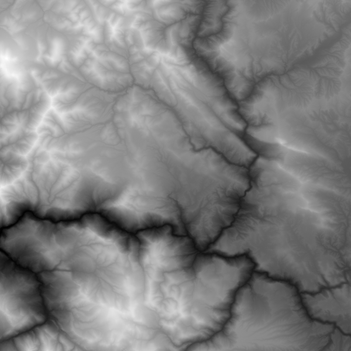
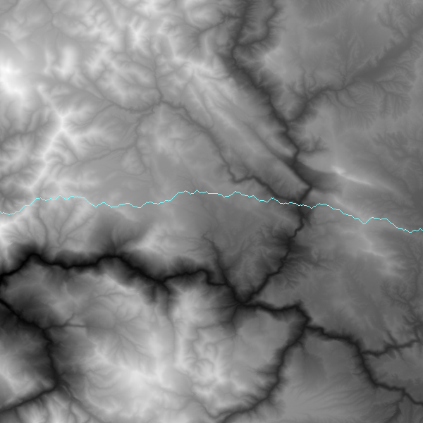
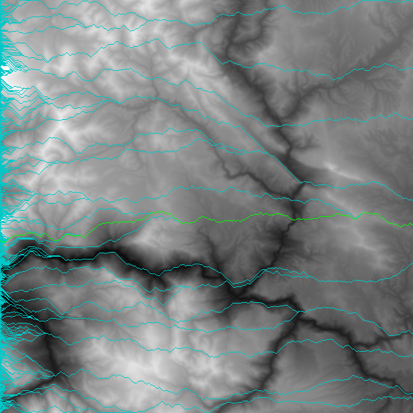

# Pathfinder

## Description

Using object-oriented programming and testing, build a program to read elevation data, draw an elevation map as a `.png` file, and chart the best path across the map.

## Objectives

After completing this assignment, you should understand:

- The basics of Python
- Installing and using a third-party library

After completing this assignment, you should be able to:

- Use Pillow to create images
- Design an object-oriented system

## Deliverables

- A Git repo containing:
  - A Python file called `pathfinder.py` that when run, creates a file called `map.png`.
  - One or more test files to test your program
  - A `Pipfile` with your dependencies listed in it

## Normal Mode

Read [the Mountain Paths PDF](MountainPaths.pdf) to get started.

Read the data from `elevation_small.txt` into an appropriate data structure to get the elevation data. This file is made up of multiple lines. Each line has a list of numbers representing elevation in meters. The elevation is the maximum elevation for a 90m x 90m square.

The numbers in this file are lined up like x-y coordinates. If the file contains the following:

```
150 175 150 200
170 191 190 182
179 191 180 182
193 195 190 192
```

Then the elevation at the top left corner (x: 0, y: 0) is 150 and the elevation at the bottom right (x: 3, y: 3) is 192. The elevation at x: 1, y: 2 is 191.

Using the [Pillow library](https://pillow.readthedocs.io/en/3.0.x/index.html), create an elevation map from the data. Higher elevations should be brighter; lower elevations darker. Read [the chapter on manipulating images from _Automate the Boring Stuff with Python_](https://automatetheboringstuff.com/chapter17/) to learn how to use Pillow.

For `elevation_small.txt`, the map should look like this:



Once you have that working, add the ability to start from the left edge of the map on any row (y-position) and calculate and draw a path across the map, using the greedy algorithm described in the Mountain Paths PDF. You can start from the middle of the left side or from a random location. If you start from the middle, your map will look something like this:



If you can do all that, you are done! There's some extra tasks to try, though.

## Advanced Mode

Starting from each location on the left-hand side of the map, plot an optimal path across the map. Calculate the total elevation change over that path. (Both moving up and down count toward the total change.) Pick the path with the least change and highlight it, drawing all paths. Your map should look something like this:



If you get that done, then read [the `argparse` module tutorial](https://docs.python.org/3.7/howto/argparse.html). Implement a command-line interface for your program, allowing the user to give the name of the elevation file on the command line. You can add more options, such as the color to use for the optimal path and other paths.

Once you do the above, you can get your own data. Go to [the NOAA Grid Extract tool](http://maps.ngdc.noaa.gov/viewers/wcs-client/). The UI is a litle funky. You want to:

- Select an area
- Download the data in "ArcGIS ASCII Grid" format.
- Remove the metadata at the top of the file, leaving just the numbers.

## Even More Advanced Mode

Note that our greedy lowest-elevation-change algorithm is flawed. It is not guaranteed to find the absolute lowest elevation change route from west to east since our decisions are limited to what's in front of us.

- Another, only slightly more complicated way to do a greedy walk is to start at an arbitrary x,y location in the map and do a greedy walk to the east from that point and a greedy walk to the west from that point. Using this method you could calculate the lowest elevation-change route that passes through every possible x,y coordinate. (Note: this will be quite slow. You may want to optimize it by tracking what coordinates you've already seen.)
- A different kind of path you might want to follow in the mountains is to travel the path that stays as low as possible, elevation-wise, regardless of the change. Think of this as a greedy algorithm that always prefers to go downhill if possible, and uphill as little as possible. You can use a greedy method for this by always choosing to step to the location with the lowest elevation, not necessarily the lowest change in elevation. Show a comparison of these two paths.
- Write a method that finds, and highlights, the lowest elevation point for each possible column in the map. Compare that to the lowest elevation path you calculated for the problem and see if any of your paths pass through that point. If you do a greedy walk going east and west, from each of those points, do you end up finding a better elevation-change route?

## Credit

Adapted from [Nifty Assignments -- Mountain Paths](http://nifty.stanford.edu/2016/franke-mountain-paths/).
